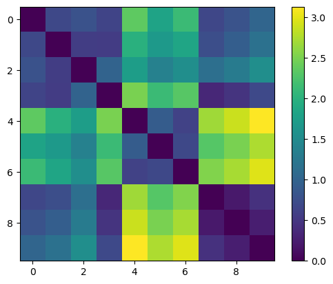
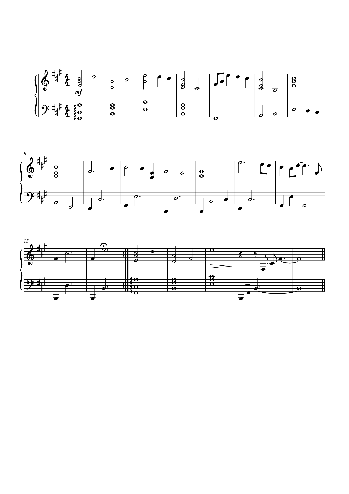

# Week 10: Audio Similarity 

## Task One

Continuing the tasks using the three other tracks from the C148 album, this week I generated a similatry matrix using the audio files in the Jupyter Notebook. Tracks 0-3 are classical, 4-6 is rock and then 7-9 is my three chosen tracks from last week. Track 7 is 'Wet Hands', track 8 is 'Dry Hands' and track 9 is 'Key'. The similarity matrix is pictured below:

## Task Two 

This task invloved transcription from my orginial musescore file and the analysed new file and then comapre them and discuss the differences. Below is my original musescore file:

And this is the result of transcribing my audio file through all of these processes:

