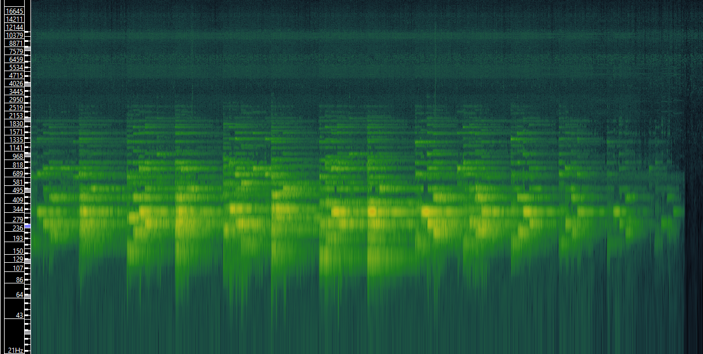
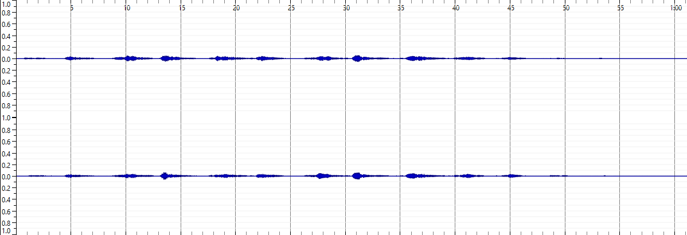
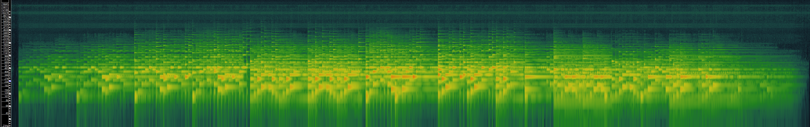
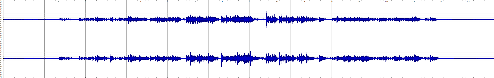
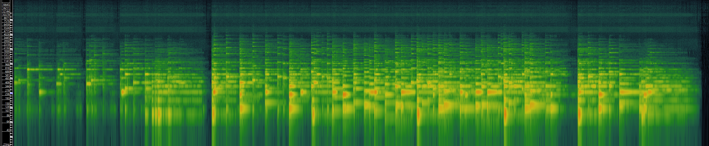
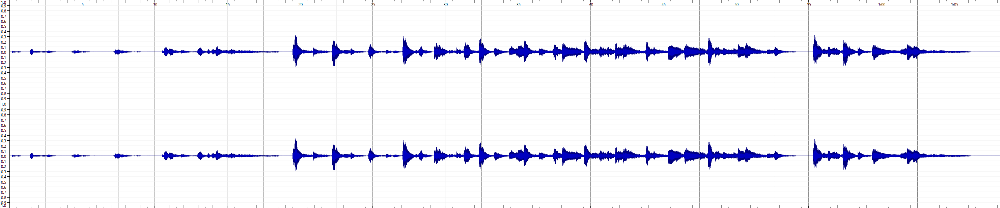

# Week 8: Music as Sound

## Task One
Below is a table describing the data surrounding the audio files in which I have chosen to focus on for this portion of the tasks, relating to my theme in the way of being in the same soundtrack:

| Title      | Artist | Composer | Copyright Info | Genre   | Source  | File/Audio Format | Channels | Sample Rate | Bits per Sample | Duration  |
|------------|--------|----------|-----------------|---------|---------|---------------------|----------|-------------|-----------------|-----------|
| Key        | C418   | C418     | © Mojang AB     | Ambient | [Here](https://downloads.khinsider.com/game-soundtracks/album/minecraft) | MP3                 | Stereo   | 44.1 kHz    | 16 bit          | 1:04 min  |
| Wet Hands  | C418   | C418     | © Mojang AB     | Ambient | [Here](https://downloads.khinsider.com/game-soundtracks/album/minecraft) | MP3                 | Stereo   | 44.1 kHz    | 16 bit          | 1:30 min  |
| Dry Hands  | C418   | C418     | © Mojang AB     | Ambient | [Here](https://downloads.khinsider.com/game-soundtracks/album/minecraft) | MP3                 | Stereo   | 44.1 kHz    | 16 bit          | 1:07 min  |

## Task Two
Below I have peformed basic analysis of the three tracks chosen on Sonic Visualiser:

'Key' Spectrogram and Waveform:

'Wet Hands' Spectrogram and Waveform:

'Dry Hands' Spectrogram and Waveform:

In terms of analysis into why time-frequency analysis has its advantages in the context of wave-form based analysis, for example it uses insights into the frequency content of a track. This is really useful when it comes to music trakcs that are hard to read the changes of frequencies within. The tracks that I have focused on are all ambient genre which makes it hard to distinguish changes in the music so this form of analysis is helpful to notice the slight frequency changes throughout the tracks.
