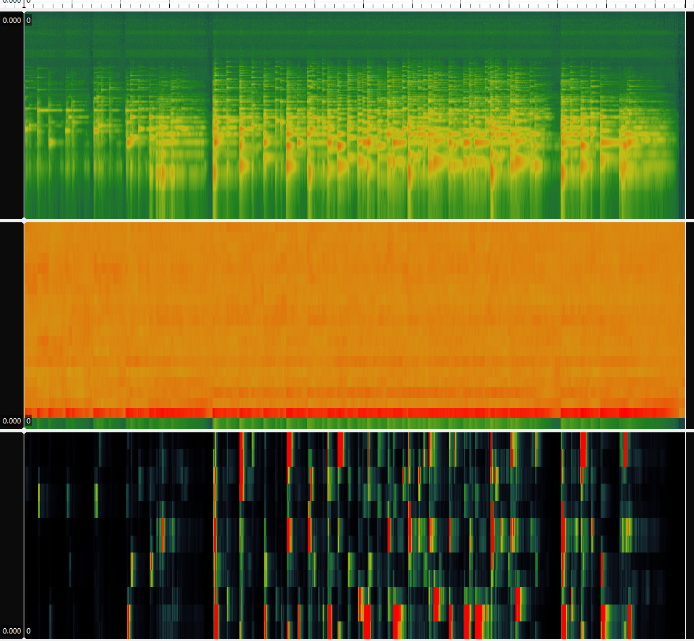
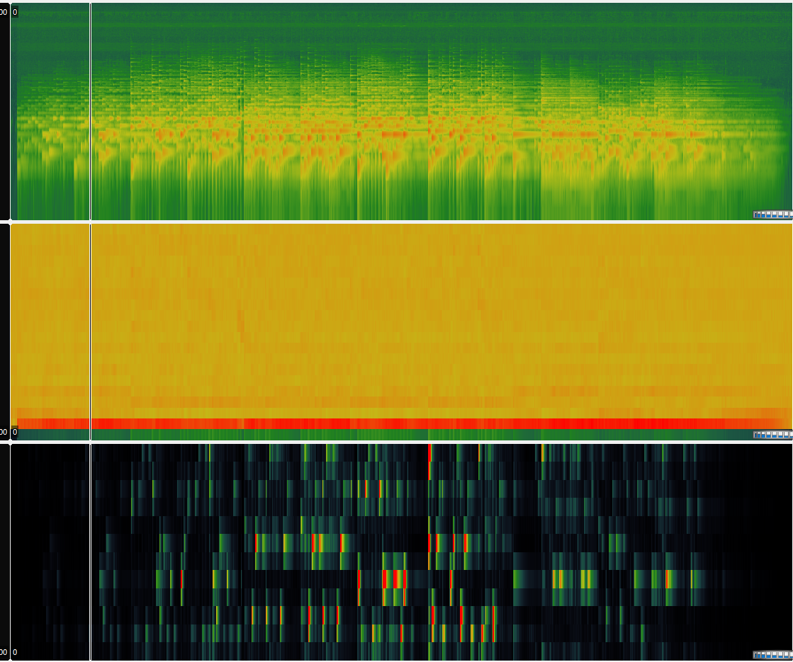

# Week 9 

## Extracting Features 

My chosen theme for this data analytics project was the soundtrack for the game Minecraft. In order to allow more room for additional analysis in this task, I also ran through two other tracks from the soundtrack album, C148.

I have prvodied the panes from my analysis via Sonic Visualiser below for each track with the top pane being a spectogram, the middle being a MFCC and the lower being a chromogram. 

### 'Dry Hands' Audio File:

### 'Wet Hands' Audio File:

### 'Key' Audio File:

