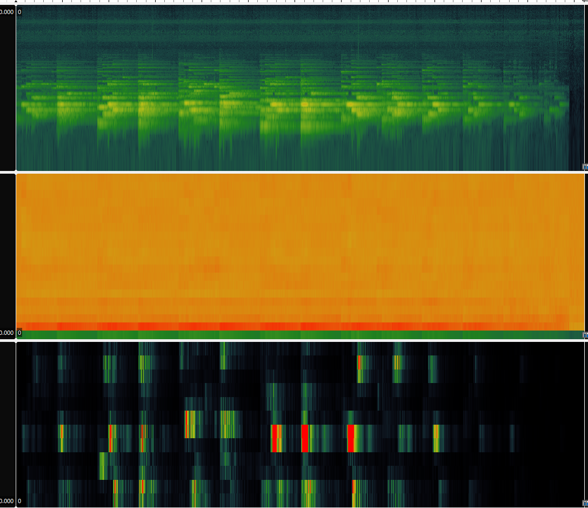
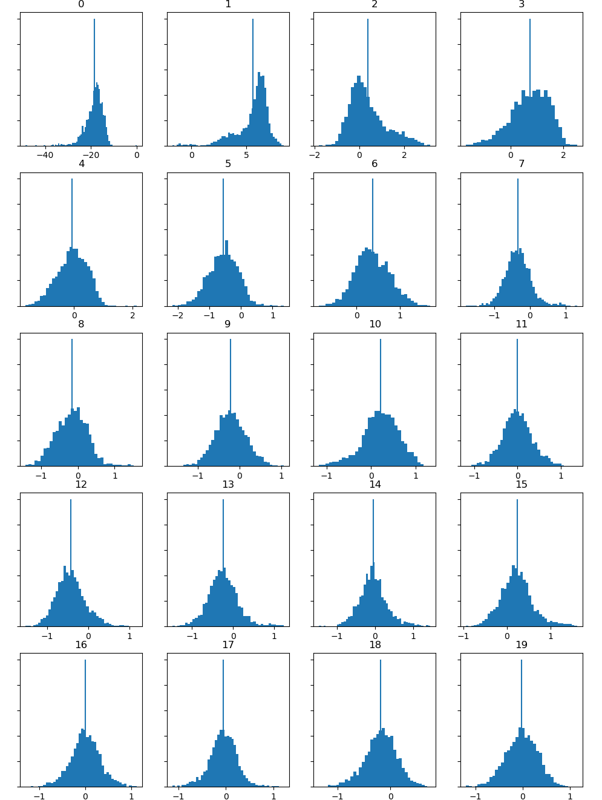
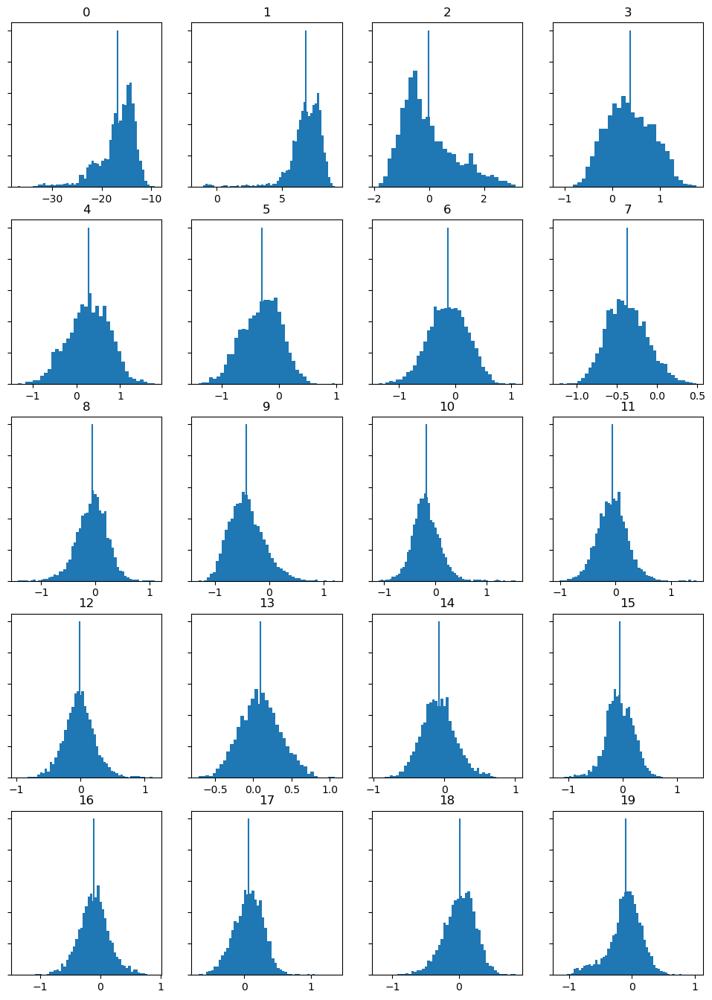
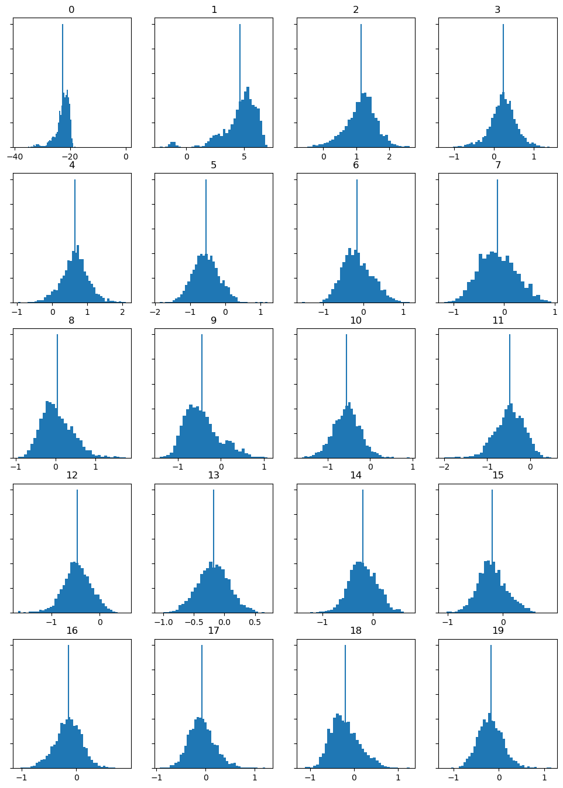

# Week 9 

## Extracting Features 

My chosen theme for this data analytics project was the soundtrack for the game Minecraft. In order to allow more room for additional analysis in this task, I also ran through two other tracks from the soundtrack album, C148.

I have prvodied the panes from my analysis via Sonic Visualiser below for each track with the top pane being a spectogram, the middle being a MFCC and the lower being a chromogram. 

### 'Dry Hands' Audio File:

### 'Wet Hands' Audio File:

### 'Key' Audio File:

## TASK TWO

After being put through Sonic Visualiser, the cvs files for the MFCC panes were put through python in order to analyse the differences between the tracks. These are histograms produced from the MFCC panes below:

### 'Dry Hands' Analysis Results:

### 'Wet Hands' Analysis Results:

### 'Key' Analysis Results:

## Analysis:

In terms of analysis, this process does allow me to see the minor differences between each track, but due to the similatiries between them it does become diffcult to see massive changes between each audio file. The genre of my chosen tracks all fall under ambience which usually doesn't have very striking or remarkable sudden or harsh keys played in it as it relies moslty on the longevity of notes. 

